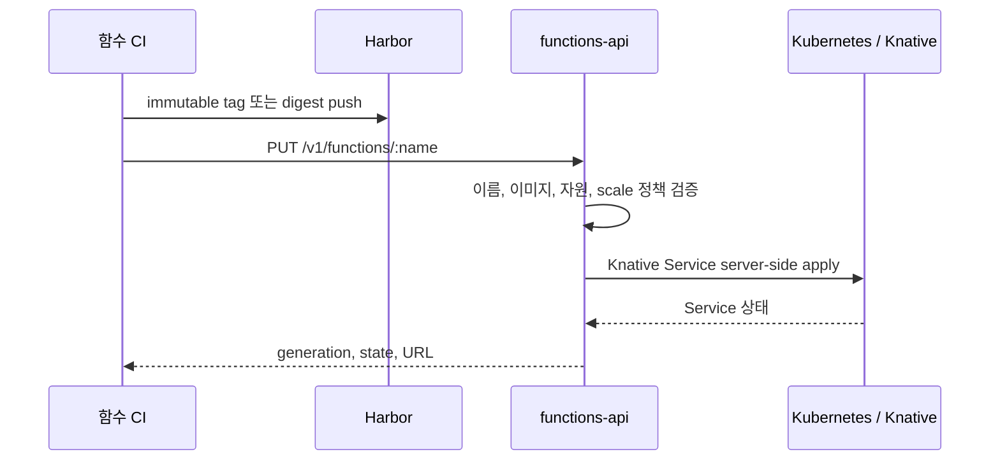
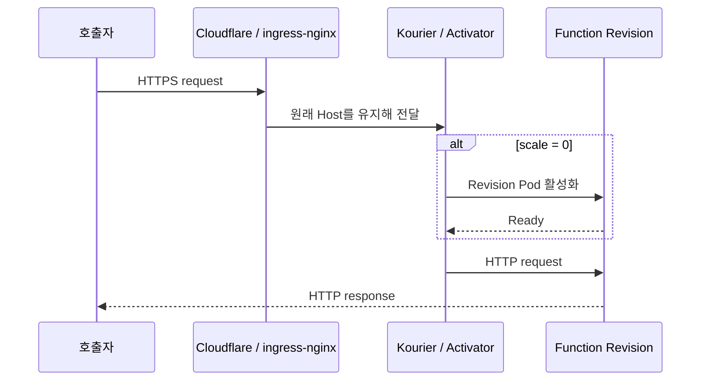

# Woostack Functions 아키텍처 초안

작성 기준일: 2026-07-12

## 1. 목표와 경계

목표는 기존 Kubernetes 서비스를 대체하는 것이 아니라, 짧은 HTTP 작업과 웹훅을 작은 OCI 이미지로 배포하고 유휴 시 0개 Pod까지 줄일 수 있는 내부 플랫폼을 추가하는 것입니다.

MVP가 제공하는 것:

- 이미지 기반 HTTP 함수 배포
- scale-to-zero와 최대 scale 제한
- 불변 Revision과 최신 Revision 상태 조회
- CPU, memory, timeout, concurrency 정책
- ConfigMap/Secret 참조
- 내부 함수와 외부 함수 구분

MVP가 제공하지 않는 것:

- ZIP/소스 업로드와 클러스터 내부 빌드
- Cron, Kafka, RabbitMQ, NATS 등의 이벤트 트리거
- AWS Lambda API 호환
- 함수별 IAM, 사용량 과금, 멀티테넌시
- 장시간 배치와 GPU workload

## 2. Knative Serving을 기반으로 선택한 이유

Knative Serving은 이 플랫폼에 필요한 HTTP 요청 기반 scale-to-zero, Revision, 트래픽 분할, OCI 이미지 실행을 이미 제공합니다. NestJS control plane은 Kubernetes 스케줄러나 autoscaler를 재구현하지 않고 사용자 입력을 조직 정책에 맞는 Knative Service로 변환합니다.

다른 선택지는 다음 이유로 기본안에서 제외했습니다.

- KEDA는 기존 Deployment/Job을 이벤트에 따라 스케일하는 구성 요소이며 함수 API, Revision, HTTP 요청 활성화 계층이 없습니다. 향후 queue consumer와 batch용 보완재로 사용합니다.
- Fission은 소스 중심 개발 경험이 좋지만 builder, storage, router, executor, runtime pool까지 새로 운영해야 합니다.
- OpenFaaS는 좋은 개발자 경험을 제공하지만 Community Edition의 현재 사용·규모 제한과 production 기능 구성을 고려하면 이 환경의 기본 기반으로 삼기 어렵습니다.

참고: [Knative Serving autoscaling](https://knative.dev/docs/serving/autoscaling/), [Knative 설치 및 네트워킹](https://knative.dev/docs/install/), [KEDA concepts](https://keda.sh/docs/2.20/concepts/), [Fission architecture](https://fission.io/docs/architecture/), [OpenFaaS deployment editions](https://docs.openfaas.com/deployment/).

## 3. 컴포넌트 소유권

| 영역 | 소유자 | 역할 |
|---|---|---|
| `functions-api` | 이 저장소 | 함수 명세 검증, Knative Service CRUD, 상태 API |
| Knative Serving/Kourier | `woostack-gitops/infra` | CRD, controller, webhook, autoscaler, activator, 내부 라우팅 |
| 함수 namespace와 정책 | `woostack-gitops/apps/functions` | ServiceAccount, Harbor Secret, quota, 공개 route |
| 개별 함수 이미지 | 각 함수 저장소/CI | 테스트, OCI 빌드, Harbor push |
| 함수 Secret | Vault + External Secrets | 값을 Git에 넣지 않고 Kubernetes Secret 생성 |
| 외부 진입 | Cloudflare + ingress-nginx | DNS/TLS/외부 route; rewrite는 한 계층에서만 소유 |
| 관측 | Prometheus 및 향후 로그/trace | 메트릭, 로그, trace, 알람 |

현재 GitOps 저장소에서 Kong Gateway API는 설치되어 있지만 HTTPRoute가 없고 실제 앱은 ingress-nginx를 사용합니다. MVP도 ingress-nginx를 외부 진입점으로 유지합니다. Kong으로 이동할 때는 Cloudflare origin과 모든 함수 Route를 한 번에 옮겨 중복 라우팅을 피해야 합니다.

## 4. 주요 흐름

### 배포



### 호출



## 5. API와 desired state

초기에는 Kubernetes의 Knative Service가 desired state이자 상태 저장소입니다. PostgreSQL을 먼저 추가하지 않는 이유는 함수 명세, generation, condition, Revision 상태가 이미 Kubernetes API에 있기 때문입니다.

관리 방식은 함수 단위로 하나만 선택합니다.

1. 동적 방식: `functions-api`가 `app.kubernetes.io/managed-by=woostack-functions` 리소스를 server-side apply합니다.
2. GitOps 방식: `/render` 결과를 Git에 커밋하고 Argo CD가 관리합니다. 이 경우 같은 함수에 `PUT`을 호출하지 않습니다.

인증·팀/프로젝트·감사 로그·별도 사용자 metadata가 필요해지면 DB를 추가하되, 실제 workload 상태의 기준은 계속 Kubernetes로 둡니다.

## 6. 네트워크

MVP 공개 경로는 다음 순서입니다.

```text
Cloudflare Tunnel
  -> ingress-nginx Service
  -> wildcard host Ingress
  -> Kourier gateway Service
  -> Knative Activator 또는 Revision
```

함수 기본값은 `cluster-local`입니다. `external`은 Knative 외부 route 생성 허용을 뜻할 뿐 인증을 제공하지 않습니다. 공개 함수에는 control plane 인증과 별개로 gateway 레벨 JWT/API key/rate limit가 필요합니다.

표준 Ingress backend는 같은 namespace의 Service만 참조하므로 Kourier gateway를 직접 backend로 쓰는 wildcard Ingress는 `kourier-system`이 소유해야 합니다. 클러스터 안의 cloudflared가 ingress-nginx ClusterIP를 호출할지 외부 NodePort를 호출할지는 원격 Cloudflare origin 설정을 확인해 결정합니다.

현재 GitOps에는 cert-manager나 TLS 리소스가 없고 Cloudflare Tunnel의 hostname/origin 설정도 저장되어 있지 않습니다. TLS 종료 위치와 wildcard 도메인은 배포 전에 Cloudflare 설정까지 포함해 확인해야 합니다.

## 7. 보안 기본값

- control plane RBAC은 `functions` namespace의 Knative Service에만 적용
- 함수 ServiceAccount의 API token 자동 mount 차단
- 관리 API는 production에서 shared Bearer token이 없으면 요청을 거부하고, Secret 참조는 정확히 `<함수이름>-secrets` 하나로 제한
- non-root, `RuntimeDefault` seccomp, privilege escalation 차단, Linux capability 전체 제거
- Knative의 `secure-pod-defaults: enabled`로 queue-proxy까지 restricted Pod Security 기준 적용
- read-only root filesystem과 별도 64 MiB `/tmp`
- Secret 값은 API request에 받지 않고 존재하는 Secret 이름만 참조
- `latest` tag 금지, immutable version tag 또는 digest 요구
- 함수별 최대 scale 20, 플랫폼 기본 최대 scale 10
- 함수와 queue-proxy의 CPU/memory/ephemeral-storage 기본값을 함께 고정해 namespace quota 계산 가능
- control plane API는 ClusterIP와 namespace 제한 NetworkPolicy만 만들며, 외부 Ingress 전에는 OIDC/RBAC으로 교체

선택한 Knative 버전의 기능 설정에는 아래 의도를 명시하고 server-side dry-run으로 확인합니다.

```yaml
apiVersion: v1
kind: ConfigMap
metadata:
  name: config-features
  namespace: knative-serving
data:
  secure-pod-defaults: enabled
  kubernetes.podspec-volumes-emptydir: enabled
```

함수 egress는 기존 서비스 호출 요구가 있으므로 MVP에서 일괄 차단하지 않습니다. 이는 신뢰된 내부 함수만 받는 단계의 제한이며, 팀/사용자 코드를 받기 전에는 함수별 downstream allowlist를 적용해야 합니다.

namespace quota는 클러스터 보호용 상한이지 함수의 `maxScale` 보장이 아닙니다. 여러 함수가 동시에 확장하면 CPU/memory quota가 먼저 소진될 수 있으므로 quota 거부 이벤트와 max-scale 도달을 알람으로 연결해야 합니다.

신뢰하지 않는 제3자 코드를 실행하게 되면 일반 Pod 격리만으로 충분하지 않습니다. 그 단계에서는 전용 node pool, egress default deny, RuntimeClass 기반 gVisor/Kata, 이미지 서명·검증, syscall/파일 제한을 별도 설계해야 합니다.

## 8. 관측성과 운영

초기 공통 label은 함수 이름과 관리 주체를 포함합니다. 다음 단계에서 추가할 항목은 다음과 같습니다.

- control plane: request count/latency/error, Kubernetes reconcile error
- 함수: invocation count/latency/status, cold start, concurrency
- trace: `traceparent`, `x-request-id`, CloudEvents `ce-id` 전달
- 알람: Revision not ready, 배포 timeout, 5xx 비율, max scale 도달
- 감사: 누가 어떤 이미지와 Secret 참조를 배포했는지 기록

현재 Fluent Bit 리소스는 GitOps 상위 kustomization에 포함되어 있지 않고 namespace 필터도 `functions`를 수집하지 않습니다. 함수 로그를 지원한다고 표시하기 전에 로그 backend와 수집 경로를 먼저 완성해야 합니다.

## 9. 단계별 로드맵

### 0단계: 설치 가능성 확인

- Kubernetes 버전과 여유 CPU/memory 확인
- 호환 Knative minor 버전 고정
- Kourier와 기존 ingress-nginx 연결 PoC
- wildcard DNS/TLS 경로 확인
- 선택한 Kubernetes 버전에 맞춰 namespace의 Pod Security label version 고정

Knative 릴리스는 Kubernetes 지원 범위가 다릅니다. 예를 들어 Knative 1.22는 Kubernetes 1.34+, 1.21은 1.33+가 필요하므로 최신 버전을 무조건 설치하지 않습니다. [Knative 1.22 release](https://knative.dev/blog/releases/announcing-knative-v1-22-release/), [Knative 1.21 release](https://knative.dev/blog/releases/announcing-knative-v1-21-release/).

### 1단계: HTTP 함수 MVP

- 이 저장소의 CRUD/render API
- Harbor 이미지 배포
- Vault Secret 참조
- private/public route
- Revision 상태와 수동 rollback
- OIDC, 팀별 namespace/RBAC, 감사 로그

### 2단계: 개발자 경험

- Node/Python 공식 runtime template
- Buildpacks 또는 Tekton 기반 격리 빌드
- SBOM, image signing, vulnerability gate
- CLI와 내부 UI
- canary traffic split과 자동 rollback

### 3단계: 이벤트/배치

- 기존 broker가 생기면 KEDA ScaledObject/ScaledJob
- CloudEvents routing, retry, DLQ 요구가 명확할 때 Knative Eventing
- 멱등성 key와 중복 실행 정책

## 10. 배포 전 미결정 사항

- 실제 Kubernetes server version과 Knative pin
- 함수 wildcard domain, Cloudflare account/origin, TLS 종료 지점
- Kourier Service를 ingress-nginx에 연결할 구체적 Ingress
- `functions-system`과 `functions`용 Harbor Vault path
- 사용자 인증 제공자와 팀/프로젝트 권한 모델
- 외부 함수별 auth/rate-limit 정책
- cold start 허용치와 `minScale: 1` 적용 기준
- 로그 backend 및 보존 기간
- Knative Revision garbage collection과 namespace quota/queue-proxy 자원 정합성
